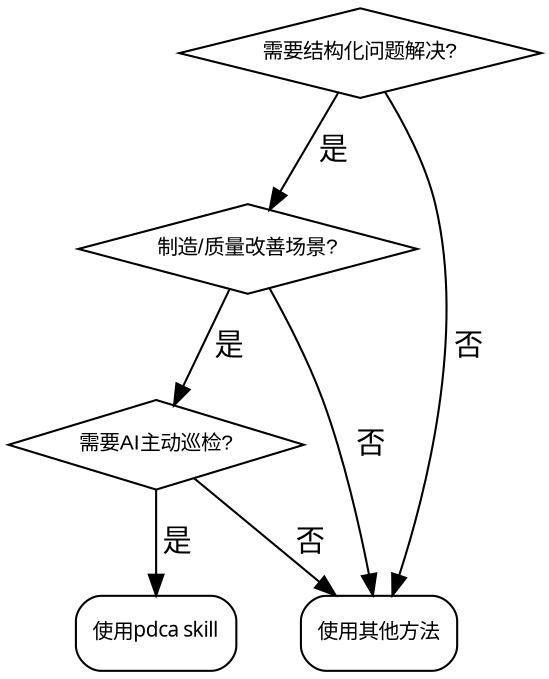

# PDCA 项目管理系统

## Overview

基于 PDCA 循环的结构化问题解决系统，由 AI 驱动实现主动巡检、SMART 目标校验和飞书工具链集成。

## When to Use



**触发症状：**
- 问题需要结构化分析（5W1H、鱼骨图、5Why）
- 需要量化目标和可衡量指标
- 需要主动进度监控和预警
- 需要经验沉淀和知识复用

**不适用的场景：**
- 简单单次任务（直接使用任务管理工具）
- 纯技术研究（无需流程闭环）
- 紧急故障处理（先修复，后复盘）

## 🎯 核心工作流 (Core Workflow)

AI 引导项目经理从问题分析到知识沉淀的全生命周期：

1. **评估与启动 (new)**：评估问题是否适合立项，创建 Bitable 应用（含数据表）+ Wiki 文档容器。
2. **计划与校验 (Plan)**：执行 SMART 校验与因果逻辑审查。
3. **执行与巡检 (Do)**：AI 通过 Bitable 数据记录主动巡检并汇总进展。
4. **检查与评估 (Check)**：分析数据偏差。
5. **决策与沉淀 (Act)**：生成标准化 SOP 并归档经验。

## 📋 项目创建详细流程 (new 命令)

### 步骤 1：评估问题是否适合 PDCA

使用 `AskUserQuestion` 询问：
1. 问题描述
2. 问题类型（设备/质量/效率/成本/流程/管理/个人健康/Other）
3. 根据类型选择合适的 MECE 框架

### 步骤 2：创建 Bitable 应用

**使用 `feishu_bitable_app.create` 创建独立的多维表格应用**：

```
API: feishu_bitable_app.create
参数:
  - name: "[项目名称] PDCA"
  - folder_token: "(可选) 放置在指定文件夹下"
```

### 步骤 3：创建 4 张核心数据表

使用 `feishu_bitable_app_table.create` 为 Bitable 应用创建以下表：

#### 表 1：项目主表 (projects)
字段：项目ID、项目名称、选择框架、当前阶段、状态、负责人、开始日期、预计结束日期、完成度、Bitable链接、Wiki链接

#### 表 2：任务数据表 (tasks)
字段：任务ID、项目ID、任务标题、任务状态、任务描述、来源维度、来源类型、截止日期、负责人、优先级、数据记录、完成度、创建时间、完成时间

#### 表 3：数据收集记录表 (data_records)
字段：记录ID、项目ID、指标名称、维度、数值、单位、记录时间、记录人

#### 表 4：执行日志表 (logs)
字段：日志ID、项目ID、阶段、日志类型、内容、记录时间、记录人

**字段类型定义**（见 `system/工具/Bitable表结构定义.md`）：
- 文本: type=1
- 数字: type=2
- 单选: type=3, property.options=["选项1", "选项2"]
- 日期: type=5（毫秒时间戳）
- 人员: type=11, 值格式: [{id: "ou_xxx"}]
- 多行文本: type=15
- 超链接: type=15, 值格式: {link: "url", text: "标题"}

### 步骤 4：创建项目 Wiki 文档容器

使用 `feishu_create_doc` 创建 Wiki 文档，用于详细分析和协作：

```
API: feishu_create_doc
参数:
  - wiki_space: "<知识空间ID>"
  - title: "[项目名称]/项目信息.md"
  - content: "# 项目信息\n\n## Bitable 应用链接\n[链接]\n\n## 问题概述\n..."
```

在 Wiki 中创建各阶段文档：
- `[项目名称]/Plan阶段/问题分析.md`
- `[项目名称]/Plan阶段/目标设定.md`
- `[项目名称]/Plan阶段/解决方案.md`
- `[项目名称]/Plan阶段/执行计划.md`

### 步骤 5：初始化项目主表记录

使用 `feishu_bitable_app_table_record.create` 在项目主表中创建记录：

```
API: feishu_bitable_app_table_record.create
参数:
  - app_token: "<从步骤2获取>"
  - table_id: "<项目主表ID>"
  - fields:
      项目ID: "<生成UUID>"
      项目名称: "[项目名称]"
      选择框架: "[选择的框架]"
      当前阶段: "Plan"
      状态: "正常"
      负责人: [{id: "ou_<用户ID>"}]
      开始日期: <当前时间戳>
      预计结束日期: <根据项目设定>
      完成度: 0
      Wiki链接: {link: "<Wiki文档URL>", text: "查看文档"}
```

### 步骤 6：更新项目索引

使用 `feishu_update_doc` 更新根目录的项目索引：

```
API: feishu_update_doc
参数:
  - document_id: "<项目索引文档ID>"
  - updates:
      - type: "append"
      - content: "| [项目名称] | Plan | 正常 | 负责人 | 日期 | 0% | [Wiki链接] |"
```

### ⚠️ 关键注意事项

1. **API 调用顺序**：必须先创建 Bitable 应用，再创建数据表，最后插入记录
2. **人员字段格式**：必须是 `[{id: "ou_xxx"}]` 数组格式
3. **日期时间戳**：使用毫秒时间戳，不是秒
4. **超链接字段**：创建时不要传 property 参数
5. **单选字段**：值是字符串，不是数组
6. **并发限制**：同一表不支持并发写，串行调用并延迟 0.5-1 秒

## 📚 渐进式披露：详细指南

根据当前任务，阅读对应的参考文档：

### 0. MECE 框架选择指南（必读，问题分析前）

**框架选择原则**：根据问题类型选择合适的 MECE 框架，确保"相互独立、完全穷尽"。

| 问题类型 | 推荐框架 | 维度 |
|---------|---------|------|
| **制造业/生产问题** | **4M1E** | Man（人员）、Machine（设备）、Material（材料）、Method（方法）、Environment（环境） |
| **个人健康/体能提升** | **TREND** | Training（训练）、Rest（休息）、Eating（营养）、Nature（先天）、Daily（日常） |
| **管理/组织问题** | **5P2E** | Plan（计划）、People（人员）、Process（流程）、Performance（绩效）、Power（权力）、External（外部）、Environment（环境） |
| **流程/服务问题** | **SIPOC** | Supplier（供应商）、Input（输入）、Process（过程）、Output（输出）、Customer（客户） |
| **软件开发/技术问题** | **PPTD** | People（人员）、Process（流程）、Technology（技术）、Product（产品）、Data（数据） |
| **销售/营销问题** | **5P** | Product（产品）、Price（价格）、Place（渠道）、Promotion（推广）、People（人员） |
| **学习/教育问题** | **COMET** | Content（内容）、Method（方法）、Time（时间）、Environment（环境）、Teacher（教师/支持） |
| **财务/投资问题** | **3RL-TD** | Return（回报）、Risk（风险）、Liquidity（流动性）、Time（时间）、Diversification（多元化） |
| **团队协作问题** | **GRCT** | Goals（目标）、Roles（角色）、Communication（沟通）、Trust（信任）、Tools（工具） |
| **客户服务问题** | **5S** | Staff（员工）、Skill（技能）、Strategy（策略）、System（系统）、Speed（速度） |
| **个人效率/时间管理** | **TIME** | Tasks（任务）、Information（信息）、Money（金钱）、Energy（精力） |

---

### 框架详细说明

#### 1. 4M1E（制造业/生产）
- **Man（人员）**：技能、培训、意识、疲劳、士气
- **Machine（设备）**：故障、维护、老化、设置、产能
- **Material（材料）**：质量、供应、规格、存储、成本
- **Method（方法）**：流程、标准、工艺、操作、SOP
- **Environment（环境）**：温度、湿度、照明、噪音、安全

#### 2. TREND（个人健康/体能）
- **Training（训练）**：强度、频率、持续时间、类型（力量/有氧/柔韧）
- **Rest（休息）**：睡眠质量、休息日、恢复时间、压力管理
- **Eating（营养）**：饮食结构、热量、宏量营养素、水分、补充剂
- **Nature（先天）**：年龄、性别、遗传、基础体能、健康状况
- **Daily（日常）**：活动量、工作性质、生活习惯、环境

#### 3. 5P2E（管理/组织）
- **Plan（计划）**：目标设定、资源分配、时间规划
- **People（人员）**：技能、培训、激励、沟通
- **Process（流程）**：工作流程、决策流程、协作流程
- **Performance（绩效）**：KPI、评估、反馈
- **Power（权力）**：授权、决策权、资源控制
- **External（外部）**：市场、客户、竞争对手、政策
- **Environment（环境）**：文化、氛围、工具、设施

#### 4. SIPOC（流程/服务）
- **Supplier（供应商）**：谁提供输入？
- **Input（输入）**：需要什么资源？
- **Process（过程）**：什么活动被执行？
- **Output（输出）**：产生什么结果？
- **Customer（客户）**：谁是接收者？

#### 5. PPTD（软件开发/技术）
- **People（人员）**：开发人员、产品经理、用户
- **Process（流程）**：开发流程、测试流程、发布流程
- **Technology（技术）**：技术栈、架构、工具
- **Product（产品）**：功能、用户体验、需求
- **Data（数据）**：数据结构、数据流、数据质量

#### 6. 5P（销售/营销）
- **Product（产品）**：功能、质量、差异化
- **Price（价格）**：定价策略、折扣、价值
- **Place（渠道）**：分销渠道、覆盖范围
- **Promotion（推广）**：广告、公关、促销
- **People（人员）**：销售团队、客户服务

#### 7. COMET（学习/教育）
- **Content（内容）**：课程内容、教材、难度
- **Method（方法）**：教学方法、练习方式、反馈
- **Time（时间）**：学习时长、频率、节奏
- **Environment（环境）**：学习环境、氛围、干扰
- **Teacher（教师/支持）**：教师质量、辅导、答疑

#### 8. 3RL-TD（财务/投资）
- **Return（回报）**：预期收益率、历史表现
- **Risk（风险）**：市场风险、信用风险、流动性风险
- **Liquidity（流动性）**：变现能力、资金周转
- **Time（时间）**：投资期限、时机
- **Diversification（多元化）**：资产配置、分散程度

#### 9. GRCT（团队协作）
- **Goals（目标）**：共同目标、目标一致性
- **Roles（角色）**：角色清晰、职责分工
- **Communication（沟通）**：沟通频率、沟通方式、信息透明
- **Trust（信任）**：信任度、心理安全
- **Tools（工具）**：协作工具、流程工具

#### 10. 5S（客户服务）
- **Staff（员工）**：人员素质、态度、技能
- **Skill（技能）**：专业知识、沟通技能
- **Strategy（策略）**：服务策略、客户分层
- **System（系统）**：服务系统、流程、工具
- **Speed（速度）**：响应速度、解决速度

#### 11. TIME（个人效率/时间管理）
- **Tasks（任务）**：任务优先级、任务分解
- **Information（信息）**：信息获取、信息过滤
- **Money（金钱）**：预算、成本控制
- **Energy（精力）**：精力管理、专注力

---

### 框架选择决策树

```
问题类型判断
    │
    ├─ 是否生产/制造相关？
    │   └─ YES → 4M1E
    │
    ├─ 是否个人健康/体能相关？
    │   └─ YES → TREND
    │
    ├─ 是否软件/技术开发相关？
    │   └─ YES → PPTD
    │
    ├─ 是否销售/营销相关？
    │   └─ YES → 5P
    │
    ├─ 是否学习/教育相关？
    │   └─ YES → COMET
    │
    ├─ 是否财务/投资相关？
    │   └─ YES → 3RL-TD
    │
    ├─ 是否团队协作相关？
    │   └─ YES → GRCT
    │
    ├─ 是否客户服务相关？
    │   └─ YES → 5S
    │
    ├─ 是否个人效率/时间管理相关？
    │   └─ YES → TIME
    │
    ├─ 是否流程/服务相关？
    │   └─ YES → SIPOC
    │
    └─ 其他管理/组织问题 → 5P2E
```

---

### ⚠️ 框架使用 Red Flags

出现以下信号时，**立即停止**，重新选择框架：
- 框架维度与问题类型不匹配 → 重新选择框架
- 维度之间有明显重叠 → 检查框架定义
- 分析过程中发现遗漏重要方面 → 补充维度或更换框架

### 0. 项目文件夹规范（必读，首次创建项目前）

**核心原则：一个项目 = 一个 Bitable 应用 + 一个 Wiki 文档容器**

每个 PDCA 项目由两部分组成：
1. **Bitable 应用**：数据管理（4张表：项目主表、任务表、数据记录表、执行日志表）
2. **Wiki 文档容器**：详细分析和协作文档（问题分析、目标设定、解决方案等）

#### 创建顺序（强制）

**⚠️ 必须按以下顺序创建，不能跳过或颠倒**：

1. **第一步**：使用 `feishu_bitable_app.create` 创建 Bitable 应用
2. **第二步**：使用 `feishu_bitable_app_table.create` 创建 4 张数据表
3. **第三步**：使用 `feishu_create_doc` 创建 Wiki 文档容器
4. **第四步**：使用 `feishu_bitable_app_table_record.create` 初始化项目主表记录
5. **第五步**：更新项目索引

#### Bitable 应用创建（第一步）

```
API: feishu_bitable_app.create
参数:
  - name: "[项目名称] PDCA"
返回:
  - app_token: 应用标识（后续创建表需要）
  - app_url: 应用链接
```

#### 数据表创建（第二步）

为每个项目创建 4 张核心表：

| 表名 | 用途 | API |
|------|------|-----|
| 项目主表 (projects) | 项目核心信息与状态管理 | feishu_bitable_app_table.create |
| 任务数据表 (tasks) | 任务分解与执行跟踪 | feishu_bitable_app_table.create |
| 数据收集记录表 (data_records) | 测量数据与指标记录 | feishu_bitable_app_table.create |
| 执行日志表 (logs) | 过程记录与决策追溯 | feishu_bitable_app_table.create |

详细字段定义见：`system/工具/Bitable表结构定义.md`

#### Wiki 文档容器创建（第三步）

使用 `feishu-create-doc` 的 `folder_token` 或 `wiki_space` 参数创建项目文档容器：

| 场景 | 方式 | 说明 |
|------|------|------|
| **知识库场景**（推荐） | `wiki_space` 参数 | 项目放在知识空间中，文件夹自动出现在空间根目录 |
| **云空间场景** | `folder_token` 参数 | 项目放在云空间指定文件夹下 |

**关键特性**：在 `create-doc` 的 `title` 参数中使用 `/`（如 `Plan阶段/问题分析`），飞书会**自动创建文件夹结构**，无需先建文件夹再建文档。

#### 项目文件夹结构

```
[飞书知识库/云空间]
└── PDCA项目管理（根目录/知识空间）
    ├── 📊 项目索引.md（所有项目状态一览）
    ├── 📚 经验库/（已完成项目沉淀）
    └── 📁 [项目名称]/（项目根文件夹，每个项目一个）
        ├── 📋 项目信息.md
        ├── 📁 Plan阶段/
        │   ├── 问题分析.md
        │   ├── 目标设定.md
        │   ├── 解决方案.md
        │   └── 执行计划.md
        ├── 📁 Do阶段/
        ├── 📁 Check阶段/
        └── 📁 Act阶段/
        └── 📊 [项目名称] Bitable（多维表格应用）
```

#### 文档创建规则

1. **项目根文件夹**：首次创建项目时，用 `create-doc` 创建"项目信息.md"，指定 `wiki_space` 或 `folder_token`，`title` 设为 `[项目名称]/项目信息`，飞书自动创建 `[项目名称]` 文件夹
2. **阶段文档**：`title` 设为 `[项目名称]/Plan阶段/问题分析`，自动归入对应文件夹
3. **项目索引**：在根目录创建或更新，记录所有项目的名称、阶段、状态、Bitable链接

#### 文档更新规则

使用 `feishu-update-doc` 更新已有文档：
- 优先使用**局部更新**（`replace_range`/`append`/`insert_before`/`insert_after`）保护图片和评论
- 慎用 `overwrite`（会清空文档重写）

### 1. 飞书集成与主动驱动
- **API 调用与工具配置**：见 [feishu-integration.md](assets/references/feishu-integration.md)
- **自治巡检**：见 [cron-driving.md](assets/references/cron-driving.md)

### 2. Bitable 原生架构（一个项目一个应用）
- **表结构定义**：见 [system/工具/Bitable表结构定义.md](system/工具/Bitable表结构定义.md)
- **收集表配置**：见 [system/工具/收集表配置指南.md](system/工具/收集表配置指南.md)
- **仪表盘组件配置**：见 [system/工具/仪表盘组件配置.md](system/工具/仪表盘组件配置.md)
- **工作流自动化配置**：见 [system/工具/工作流自动化配置.md](system/工具/工作流自动化配置.md)
- **Bitable 应用文档模板**：见 [system/工具/Bitable应用文档模板.md](system/工具/Bitable应用文档模板.md)
- **OpenClow API 集成**：见 [system/工具/OpenClow API集成.md](system/工具/OpenClow API集成.md)

### 3. 各阶段执行 Agent
- **Plan 阶段 (规划/校验)**：见 [plan-agent.md](assets/references/plan-agent.md)
- **Do 阶段 (执行/日志)**：见 [do-agent.md](assets/references/do-agent.md)
- **Check 阶段 (数据/评估)**：见 [check-agent.md](assets/references/check-agent.md)
- **Act 阶段 (决策/沉淀)**：见 [act-agent.md](assets/references/act-agent.md)

### 4. 质量与逻辑校验 (Validators)
- **SMART 原则校验**：见 [transition-checklist.md](assets/references/transition-checklist.md)
- **因果逻辑链审查**：见 [exception-handling.md](assets/references/exception-handling.md)

### 5. 制造场景模板
- **OEE/质量改善模板库**：见 [manufacturing-templates.md](assets/references/manufacturing-templates.md)

### 5. 任务与日程管理（新增）
- **Bitable 表结构**：见 [Bitable表结构定义.md](system/工具/Bitable表结构定义.md)
- **任务自动生成**：见 [任务自动生成器.md](system/工具/任务自动生成器.md)
- **智能巡检频率**：见 [智能巡检频率.md](system/工具/智能巡检频率.md)
- **仪表板生成**：见 [仪表板生成器.md](system/工具/仪表板生成器.md)
- **表单配置**：见 [表单配置生成器.md](system/工具/表单配置生成器.md)
- **仪表板模板**：见 [dashboard-templates.md](assets/references/dashboard-templates.md)

## ⚡ Quick Reference

| 指令 | 触发场景 | 输出 |
|------|---------|--------|
| `new` | 启动新项目 | 创建 Bitable 应用（4张表）+ Wiki 文档容器 + 项目索引更新 |
| `ongoing` | 管理活跃项目 | 进度检查 + 状态更新 + 预警 |
| `achieve` | 检索经验库 | 最佳实践推荐 + 模板匹配 |

| API | 用途 |
|-----|------|
| `feishu_bitable_app.create` | 创建 Bitable 应用 |
| `feishu_bitable_app_table.create` | 创建数据表并定义字段 |
| `feishu_bitable_app_table_record.create` | 插入数据记录 |
| `feishu_bitable_app_table_record.update` | 更新数据记录 |
| `feishu_bitable_app_table_record.search` | 搜索数据记录 |
| `feishu_create_doc` | 创建 Wiki 文档 |
| `feishu_update_doc` | 更新 Wiki 文档 |

| 阶段 | 核心交付物 | 校验标准 |
|------|-----------|---------|
| Plan | 问题分析、目标设定、解决方案 | SMART + 因果逻辑 |
| Do | 执行日志、进度报告、问题记录 | 任务完成率 + 数据完整性 |
| Check | 数据分析、效果评估、问题诊断 | 目标达成率 + 趋势分析 |
| Act | 行动决策、实施方案、知识总结 | 决策矩阵 + SOP 沉淀 |

## ⚠️ 核心规则

1. **数据事实来源**：飞书 Bitable 是项目状态的唯一事实来源。
2. **主动上报**：巡检发现逻辑偏差或进度停滞，立即发送交互式卡片。
3. **用户决策**：所有阶段转换和项目结项必须经过用户确认。

## 🎯 用户交互规范

### 选项设计原则（强制）

使用 `AskUserQuestion` 时，**必须**遵循以下规则：

#### 规则 1：必须有"Other"选项

所有**单选问题**必须包含"Other"选项，允许用户自定义输入。

**正确示例**：
```yaml
questions:
  - question: "这个问题属于哪个类型？"
    options:
      - label: "设备问题"
        description: "与设备故障、维护相关的问题"
      - label: "质量问题"
        description: "与产品缺陷、工艺相关的问题"
      - label: "效率问题"
        description: "与生产效率、OEE相关的问题"
      - label: "Other"
        description: "其他类型问题（请自定义输入）"
```

**❌ 错误示例**：没有"Other"选项
```yaml
options:
  - label: "设备问题"
  - label: "质量问题"
  - label: "效率问题"
# 用户的问题可能是"人员问题"，但无法选择！
```

#### 规则 2：多选允许自定义

**多选问题**应设置 `multiSelect: true`，并在选项中包含"其他（请说明）"选项。

#### 规则 3：选项要互斥且穷尽

- **互斥**：确保选项之间相互独立，没有重叠
- **穷尽**：覆盖常见情况 + "Other"选项

### ⚠️ 选项设计 Red Flags

出现以下信号时，**立即停止**，重新设计选项：

- 没有"Other"或"自定义"选项 → 添加 Other 选项
- 选项之间有明显重叠 → 重新定义选项边界
- 用户说"我的情况不在选项里" → 选项设计失败，重新设计

**All of these mean: 停下来，添加完整的选项设计。**

## 🚨 Common Mistakes

| 错误 | 后果 | 修正 |
|------|------|------|
| **使用 `feishu_create_doc` 创建项目** | 只创建 Wiki 文档，没有 Bitable 应用，无法进行数据管理 | 必须使用 `feishu_bitable_app.create` 创建 Bitable 应用 |
| **忘记创建数据表** | Bitable 应用是空的，无法记录数据 | 必须用 `feishu_bitable_app_table.create` 创建 4 张核心表 |
| **人员字段格式错误** | API 报错或数据无法保存 | 人员字段必须是 `[{id: "ou_xxx"}]` 数组格式 |
| **日期字段使用秒时间戳** | 日期显示错误 | 日期字段使用**毫秒时间戳** |
| **跳过 Bitable 直接创建 Wiki** | 数据和文档分离，无法统一管理 | 先创建 Bitable 应用，再创建 Wiki 文档容器 |
| 项目文档创建在错误的文件夹 | 文档分散，无法统一管理 | 必须创建在 `wiki_space` 参数指定的知识空间下 |
| `create-doc` 前未确认 `wiki_space` | 文档被创建到个人空间根目录 | 创建前必须确认 `wiki_space` 参数正确 |
| `title` 中未使用 `/` 分隔路径 | 扁平结构，没有文件夹层次 | `title` 使用 `[项目名]/[阶段名]/[文档名]` 格式 |
| `update-doc` 时使用 `overwrite` 模式 | 丢失图片、评论和协作历史 | 优先使用 `replace_range`/`append`/`insert_after` |
| 未确认文件夹位置就开始创建文档 | 文档散落在错误位置 | 必须先确认项目文件夹的 `folder_token`/`wiki_space` |
| 跳过 MECE 框架直接分析原因 | 遗漏关键维度，分析不全面 | 使用 4M1E/PDCA/SIPOC 框架逐维度扫描 |
| AskUserQuestion 没有"Other"选项 | 用户被迫选择不合适的选项 | 所有单选问题必须包含"Other"选项 |
| 创建项目后未更新项目索引 | 无法跟踪所有项目进展 | 必须在"项目索引.md"中添加记录 |
| 跳过 SMART 校验直接进入 Do | 目标模糊导致执行偏差 | 使用 `system/规范/Validators/smart.md` 强制校验 |
| 数据源不一致 | 分析结论错误 | 飞书 Bitable 是唯一事实来源 |
| 手动更新 Cron 任务 | 巡检失效或冲突 | 通过 PDCA 控制器统一管理 |
| 阶段转换无用户确认 | 流程失控 | 转换前必须发送交互式卡片等待确认 |
| 根因-措施不对应 | 改善无效 | 使用 `system/规范/Validators/logic.md` 验证逻辑链 |

## 🚦 Red Flags - STOP and Start Over

出现以下信号时，**立即停止**，返回相应阶段：

- **Bitable 创建相关**：
  - 想用 `feishu_create_doc` 创建项目数据结构 → **停止**，必须用 `feishu_bitable_app.create`
  - 创建 Bitable 应用后忘记创建数据表 → **停止**，必须创建 4 张核心表
  - 想跳过 Bitable 直接用 Wiki 管理数据 → **停止**，Bitable 是数据管理的唯一事实来源

- **文档创建相关**：
  - 文档创建失败 → **立即停止**，向用户报告错误，不要在其他位置创建文件
  - 想说"在任意位置创建也可以" → 错误，必须创建在项目文件夹下
  - 想说"先创建本地文件" → 错误，不能创建本地文件作为 fallback
  - `wiki_space` 或 `folder_token` 不明确 → 先获取正确的参数

- **问题分析相关**：
  - 目标没有具体数字 → 回到 Plan，完成 SMART 校验
  - 说"这个原因应该够了" → 是否穷尽所有 MECE 维度？
  - 说"这个维度不相关" → 是否有数据支持？
  - 直接接受用户提供的原因列表 → 是否用 MECE 框架验证？
  - 跳过某个 MECE 维度 → 是否真的不相关？

- **选项设计相关**：
  - AskUserQuestion 没有"Other"选项 → 添加 Other 选项
  - 用户说"我的情况不在选项里" → 选项设计失败，重新设计

- **Wiki 结构相关**：
  - 项目创建在"PDCA项目管理"之外 → 重新创建到正确位置
  - 创建项目后未更新项目索引 → 立即更新索引

- **通用相关**：
  - 说"执行中再调整" → 目标不够清晰，拒绝进入 Do
  - 说"快速补救一下" → 补救≠符合标准，坚持完成检查清单
  - 说"老板在催，先开始吧" → 权威压力不是降低标准的理由
  - 说"已经花了 X 周了" → 沉没成本不是跳过检查的理由

**All of these mean: 停下来，完成标准流程后再继续。**

## 🛡️ Rationalization 防御

| 借口 | 现实 |
|------|------|
| "Bitable 创建太复杂，先用 Wiki 文档顶替" | Wiki 文档无法做数据管理，没有 Bitable 的核心功能就失去 PDCA 系统的价值 |
| "用户急着要，我先创建 Wiki 文档" | Wiki 文档不等于项目管理系统，匆忙创建错误结构更难修复 |
| "Bitable API 可能不支持，我试试用 Wiki" | 不先验证就降级方案，是技术债务的源头 |
| "文档创建失败，我先在根目录创建" | 在错误位置创建 = 结构破坏，更难修复 |
| "用户急着要，我先创建本地文件" | 本地文件不在知识库中，无法同步和巡检 |
| "folder_token 可能不对，但我试试看" | 参数不对会导致创建失败或创建在错误位置 |
| "这个项目简单，不需要完整的文件夹结构" | 简单项目也需要完整的 PDCA 结构 |
| "MECE 太复杂，简单问一下就行" | 简单提问 = 遗漏关键因素 |
| "用户已经说了原因，不需要再分析" | 用户说的是现象，不是根因 |
| "4M1E 不适用于这个问题" | 4M1E 是制造业标准，必须先尝试 |
| "选项已经覆盖所有情况了" | 你无法预知所有情况 |
| "Other 选项会让用户困惑" | 没有 Other 才会让用户被迫选择 |
| "在任意位置创建更方便" | 分散的项目无法统一管理 |
| "项目索引可以后面再建" | 没有索引 = 无法跟踪进展 |
| "整篇 overwrite 覆盖更快" | overwrite 会清空文档重写，丢失图片、评论、协作历史 |

**Violating the letter of the rules is violating the spirit of the rules.**

## 🔧 关键指令集

- **`new`**：初始化新项目
- **`ongoing`**：管理活跃项目
- **`achieve`**：检索经验库
