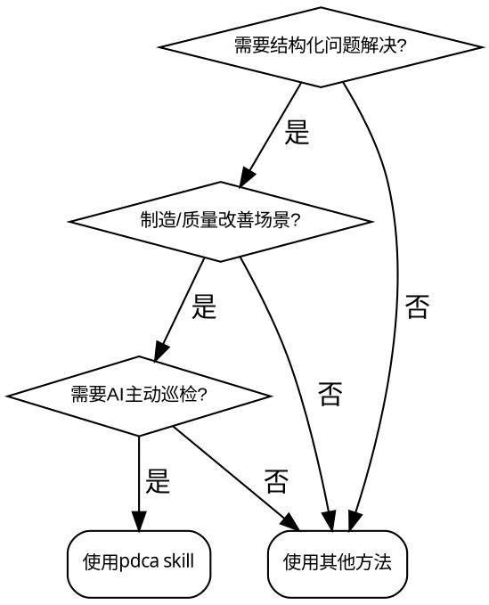

# PDCA 项目管理系统

## Overview

基于 PDCA 循环的结构化问题解决系统，由 AI 驱动实现主动巡检、SMART 目标校验和飞书工具链集成。

## When to Use

**触发症状：**
- 问题需要结构化分析（5W1H、鱼骨图、5Why）
- 需要量化目标和可衡量指标
- 需要主动进度监控和预警
- 需要经验沉淀和知识复用

**不适用的场景：**
- 简单单次任务（直接使用任务管理工具）
- 纯技术研究（无需流程闭环）
- 紧急故障处理（先修复，后复盘）

## 🎯 核心工作流 (Core Workflow)

AI 引导项目经理从问题分析到知识沉淀的全生命周期：

1. **评估与启动 (new)**：评估问题是否适合立项，自动在飞书创建资源。
2. **计划与校验 (Plan)**：执行 SMART 校验与因果逻辑审查。
3. **执行与巡检 (Do)**：AI 定期巡检云文档并汇总进展。
4. **检查与评估 (Check)**：分析数据偏差。
5. **决策与沉淀 (Act)**：生成标准化 SOP 并归档经验。

## 📚 渐进式披露：详细指南

根据当前任务，阅读对应的参考文档：

### 1. 飞书集成与主动驱动
- **API 调用与工具配置**：见 [feishu-integration.md](references/feishu-integration.md)
- **自治巡检与 Cron 逻辑**：见 [cron-driving.md](references/cron-driving.md)

### 2. 各阶段执行 Agent
- **Plan 阶段 (规划/校验)**：见 [plan-agent.md](references/plan-agent.md)
- **Do 阶段 (执行/日志)**：见 [do-agent.md](references/do-agent.md)
- **Check 阶段 (数据/评估)**：见 [check-agent.md](references/check-agent.md)
- **Act 阶段 (决策/沉淀)**：见 [act-agent.md](references/act-agent.md)

### 3. 质量与逻辑校验 (Validators)
- **SMART 原则校验**：见 [transition-checklist.md](references/transition-checklist.md)
- **因果逻辑链审查**：见 [exception-handling.md](references/exception-handling.md)

### 4. 制造场景模板
- **OEE/质量改善模板库**：见 [manufacturing-templates.md](references/manufacturing-templates.md)

## ⚡ Quick Reference

| 指令 | 触发场景 | 输出 |
|------|---------|------|
| `new` | 启动新项目 | 飞书 Wiki + Bitable + Calendar + Cron |
| `ongoing` | 管理活跃项目 | 进度检查 + 状态更新 + 预警 |
| `achieve` | 检索经验库 | 最佳实践推荐 + 模板匹配 |

| 阶段 | 核心交付物 | 校验标准 |
|------|-----------|---------|
| Plan | 问题分析、目标设定、解决方案 | SMART + 因果逻辑 |
| Do | 执行日志、进度报告、问题记录 | 任务完成率 + 数据完整性 |
| Check | 数据分析、效果评估、问题诊断 | 目标达成率 + 趋势分析 |
| Act | 行动决策、实施方案、知识总结 | 决策矩阵 + SOP 沉淀 |

## ⚠️ 核心规则

1. **数据事实来源**：飞书 Bitable 是项目状态的唯一事实来源。
2. **主动上报**：巡检发现逻辑偏差或进度停滞，立即发送交互式卡片。
3. **用户决策**：所有阶段转换和项目结项必须经过用户确认。

## 🚨 Common Mistakes

| 错误 | 后果 | 修正 |
|------|------|------|
| 跳过 SMART 校验直接进入 Do | 目标模糊导致执行偏差 | 使用 `_系统/规范/Validators/smart.md` 强制校验 |
| 数据源不一致 | 分析结论错误 | 飞书 Bitable 是唯一事实来源 |
| 手动更新 Cron 任务 | 巡检失效或冲突 | 通过 PDCA 控制器统一管理 |
| 阶段转换无用户确认 | 流程失控 | 转换前必须发送交互式卡片等待确认 |
| 根因-措施不对应 | 改善无效 | 使用 `_系统/规范/Validators/logic.md` 验证逻辑链 |

## 🚦 Red Flags - STOP and Start Over

出现以下信号时，**立即停止**，返回相应阶段：

- 目标没有具体数字 → 回到 Plan，完成 SMART 校验
- 说"执行中再调整" → 目标不够清晰，拒绝进入 Do
- 说"快速补救一下" → 补救≠符合标准，坚持完成检查清单
- 说"老板在催，先开始吧" → 权威压力不是降低标准的理由
- 说"已经花了 X 周了" → 沉没成本不是跳过检查的理由
- 直接接受用户提供的原因 → 用 5Why/鱼骨图验证根因

**All of these mean: 停下来，完成标准流程后再继续。**

## 🛡️ Rationalization 防御

| 借口 | 现实 |
|------|------|
| "时间紧迫，需要快速启动" | 没有清晰目标的快速启动 = 方向错误地加速 |
| "没有项目经理，用简单方法" | 简单方法也需要 SMART 目标作为基础 |
| "用户已经识别了问题原因" | 用户提供的是现象，不一定是根因 |
| "Plan 已经 3 周了，太长了" | 时间不是跳过质量检查的理由 |
| "执行中可以调整" | 模糊目标在执行中只会更模糊 |
| "快速补救就够了" | 补救≠符合标准，无法完成真正的 SMART 校验 |
| "老板催进度" | 权威压力不是降低标准的理由 |

**Violating the letter of the rules is violating the spirit of the rules.**

## 🔧 关键指令集

- **`new`**：初始化新项目
- **`ongoing`**：管理活跃项目
- **`achieve`**：检索经验库
